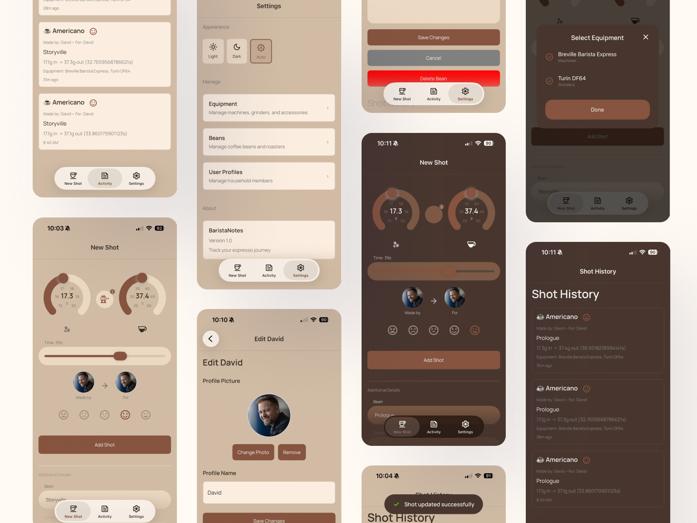

# BaristaNotes

A modern espresso shot tracking application built with .NET MAUI and MauiReactor, demonstrating declarative UI patterns and offline-first architecture for mobile development.



## Overview

BaristaNotes helps coffee enthusiasts track and analyze their espresso shots. Built as an educational project, it showcases modern .NET MAUI development patterns, reactive UI architecture, and offline-first data persistence strategies.

### What You Can Do

- **Track Espresso Shots**: Log detailed parameters including dose, grind setting, extraction time, output weight, and taste ratings
- **Manage Coffee Beans**: Store information about different coffee beans with roast dates, origins, and roaster details
- **Equipment Tracking**: Keep records of your espresso machines, grinders, and accessories
- **User Profiles**: Support multiple users (maker and recipient) with custom avatars
- **Activity Feed**: Review shot history with filtering and sorting capabilities
- **Dark Mode**: Full theme support with coffee-inspired color palettes

## Educational Purpose

This project serves as a learning resource for:

- **MauiReactor Patterns**: Declarative, component-based UI development
- **Offline-First Architecture**: Local data persistence with Entity Framework Core
- **MVVM Alternative**: State-driven UI updates without traditional MVVM boilerplate
- **Cross-Platform Development**: Single codebase targeting iOS, Android, macOS, and Windows
- **Modern C# Features**: Leveraging C# 12 and .NET 10 capabilities

## Technology Stack

### Core Frameworks

- **.NET 10.0**: Latest .NET platform for cross-platform development
- **.NET MAUI 10.0**: Multi-platform App UI framework
- **C# 12**: Modern language features including primary constructors and collection expressions

### UI Framework

- **MauiReactor 4.0.3-beta**: Declarative UI framework inspired by React
  - Component-based architecture with Props and State
  - Functional composition of UI elements
  - Hot-reload support for rapid development

### Data Layer

- **Entity Framework Core 10.0**: ORM for data access
- **SQLite**: Lightweight, embedded database for local storage
- **CoreSync**: Prepared for future offline-first synchronization capabilities

### Additional Libraries

- **CommunityToolkit.Maui 13.0.0**: MAUI community extensions and behaviors
- **UXDivers.Popups.Maui 0.9.0**: Modal dialogs and user feedback
- **The49.Maui.BottomSheet 8.0.3**: Bottom sheet UI pattern
- **Syncfusion.Maui.Gauges 31.2.16**: Radial gauge for interactive ratings

## Architecture

BaristaNotes follows a layered architecture designed for testability and maintainability:

```
BaristaNotes/              # MAUI application project
  ├── Pages/               # MauiReactor page components
  ├── Components/          # Reusable UI components
  ├── Services/            # Platform-specific services
  └── Resources/           # Images, fonts, styles

BaristaNotes.Core/         # Business logic and data layer
  ├── Models/              # Entity models and enums
  ├── Services/            # Business services and interfaces
  ├── Data/                # DbContext and data access
  └── Migrations/          # EF Core database migrations

BaristaNotes.Tests/        # Unit and integration tests
  └── Unit/
      └── Services/        # Service layer tests
```

For detailed architecture documentation, see:

- [MauiReactor Patterns](docs/MAUIREACTOR_PATTERNS.md) - Component architecture and state management
- [Data Layer Design](docs/DATA_LAYER.md) - Entity Framework Core and repository patterns
- [Service Architecture](docs/SERVICES.md) - Business logic and dependency injection

## Getting Started

### Prerequisites

- **.NET 10 SDK** or later
- **Visual Studio 2022** (Windows/Mac) or **Visual Studio Code** with C# DevKit
- Platform-specific requirements:
  - **iOS/macOS**: Xcode 15+
  - **Android**: Android SDK 21+ (Android 5.0 Lollipop)
  - **Windows**: Windows 10.0.19041.0+

### Build and Run

1. **Clone the repository**
   ```bash
   git clone https://github.com/yourusername/BaristaNotes.git
   cd BaristaNotes
   ```

2. **Restore dependencies**
   ```bash
   dotnet restore
   ```

3. **Run the application**
   
   For iOS Simulator:
   ```bash
   dotnet build -t:Run -f net10.0-ios
   ```
   
   For Android:
   ```bash
   dotnet build -t:Run -f net10.0-android
   ```
   
   For Windows:
   ```bash
   dotnet build -t:Run -f net10.0-windows10.0.19041.0
   ```

4. **Using Visual Studio**
   - Open `BaristaNotes.sln`
   - Select your target platform from the dropdown
   - Press F5 to build and run

### Running Tests

```bash
dotnet test BaristaNotes.Tests/BaristaNotes.Tests.csproj
```

## Key Concepts Demonstrated

### 1. MauiReactor Component Model

MauiReactor uses a React-like declarative pattern. Components consist of:

```csharp
// State: Local component data
class MyPageState
{
    public string UserInput { get; set; }
    public bool IsLoading { get; set; }
}

// Props: Data passed from parent
class MyPageProps
{
    public int ItemId { get; set; }
}

// Component: Renders UI based on Props and State
class MyPage : Component<MyPageState, MyPageProps>
{
    public override VisualNode Render()
    {
        return ContentPage(
            VStack(
                Label($"Item: {Props.ItemId}"),
                Entry(State.UserInput)
                    .OnTextChanged(text => SetState(s => s.UserInput = text))
            )
        );
    }
}
```

See [MAUIREACTOR_PATTERNS.md](docs/MAUIREACTOR_PATTERNS.md) for comprehensive examples.

### 2. Dependency Injection

Services are registered in `MauiProgram.cs` and injected into components using the `[Inject]` attribute:

```csharp
partial class ShotLoggingPage : Component<ShotLoggingState>
{
    [Inject]
    IShotService _shotService;
    
    async Task SaveShot()
    {
        await _shotService.CreateShotAsync(/* ... */);
    }
}
```

### 3. Entity Framework Core Patterns

The application uses:
- **Code-First Migrations**: Database schema defined in C# models
- **DTOs**: Separating database entities from API/UI contracts
- **Service Layer**: Business logic encapsulated in service classes

See [DATA_LAYER.md](docs/DATA_LAYER.md) for database design and migration strategies.

### 4. Navigation with Props

MauiReactor supports type-safe navigation with strongly-typed props:

```csharp
// Navigate to shot logging page in edit mode
await Shell.Current.GoToAsync<ShotLoggingPageProps>(
    "shot-logging", 
    props => props.ShotId = shotId
);
```

### 5. Platform Services

Platform-specific functionality (photo picker, image processing) is abstracted behind interfaces:

```csharp
public interface IImagePickerService
{
    Task<Stream?> PickImageAsync();
}

// Implemented using MAUI's IMediaPicker
```

## Project Structure Deep Dive

### Pages

Each page is a MauiReactor component with optional Props and State classes:

- **ShotLoggingPage**: Create and edit espresso shot records
- **ActivityFeedPage**: Browse shot history with filters
- **BeanManagementPage**: List and manage coffee beans
- **BeanDetailPage**: View/edit bean details with shot history
- **EquipmentManagementPage**: Manage espresso equipment
- **EquipmentDetailPage**: View/edit equipment details
- **UserProfileManagementPage**: Manage user profiles
- **ProfileFormPage**: Create/edit user profiles with avatars
- **SettingsPage**: Application settings and theme selection

### Components

Reusable UI components following the composition pattern:

- **FormFields**: Reusable form input components (Entry, Picker, Slider, Editor)
- **ShotRecordCard**: Displays shot summary in lists
- **CircularAvatar**: User profile image with circular crop
- **ProfileImagePicker**: Image selection with validation and processing
- **BottomSheet Components**: Modal bottom sheets for forms and confirmations

### Services

#### Core Services (BaristaNotes.Core)

- **ShotService**: CRUD operations for shot records
- **BeanService**: Coffee bean management
- **EquipmentService**: Equipment tracking
- **UserProfileService**: User profile management
- **PreferencesService**: App preferences and settings

#### Platform Services (BaristaNotes)

- **ImagePickerService**: Photo selection abstraction
- **ImageProcessingService**: Image resizing and optimization
- **FeedbackService**: User notifications and popups

## Database Schema

BaristaNotes uses SQLite with Entity Framework Core. Key entities:

- **ShotRecord**: Espresso shot data (dose, time, output, rating, timestamp)
- **Bean**: Coffee bean information (name, roaster, origin, roast date)
- **Equipment**: Machines, grinders, and accessories
- **UserProfile**: User information with avatar support

Relationships:
- Shot → Bean (many-to-one)
- Shot → Equipment (many-to-many via junction tables)
- Shot → UserProfile (maker and recipient, many-to-one each)

For complete schema documentation, see [DATA_LAYER.md](docs/DATA_LAYER.md).

## Testing Strategy

The project includes comprehensive unit tests for the service layer:

- **Service Tests**: Business logic validation
- **Mock DbContext**: In-memory database for isolated tests
- **Integration Tests**: End-to-end data flow verification

Example test structure:

```csharp
public class ShotServiceTests
{
    private readonly DbContextOptions<BaristasDbContext> _options;
    
    [Fact]
    public async Task CreateShotAsync_ValidData_CreatesShotSuccessfully()
    {
        // Arrange
        using var context = new BaristasDbContext(_options);
        var service = new ShotService(context);
        
        // Act
        var result = await service.CreateShotAsync(/* ... */);
        
        // Assert
        Assert.NotNull(result);
    }
}
```

## Development Workflow

### Hot Reload

MauiReactor supports hot reload for rapid UI development:

1. Make UI changes in your component's Render method
2. Save the file
3. UI updates automatically in the running app (no rebuild required)

### Database Migrations

When modifying entity models:

```bash
# Add a new migration
dotnet ef migrations add MigrationName --project BaristaNotes.Core

# Update the database
dotnet ef database update --project BaristaNotes.Core
```

### Adding New Features

1. Create/update entity models in `BaristaNotes.Core/Models`
2. Run EF migrations if database changes are needed
3. Add service interface and implementation in `BaristaNotes.Core/Services`
4. Create UI components in `BaristaNotes/Pages` or `BaristaNotes/Components`
5. Register services in `MauiProgram.cs`
6. Add unit tests in `BaristaNotes.Tests`

## Contributing

This is an educational project. Contributions that enhance its learning value are welcome:

- Additional documentation and code comments
- More comprehensive examples of MAUI/MauiReactor patterns
- Unit test coverage improvements
- Accessibility enhancements
- Performance optimizations with explanations

Please ensure:
- Code follows existing patterns and conventions
- New features include tests
- Documentation is updated to reflect changes
- Educational value is maintained or enhanced

## Resources

### Official Documentation

- [.NET MAUI Documentation](https://learn.microsoft.com/en-us/dotnet/maui/)
- [MauiReactor Documentation](https://github.com/adospace/reactorui-maui)
- [Entity Framework Core Documentation](https://learn.microsoft.com/en-us/ef/core/)

### Learning Materials

- [MAUI Community Toolkit](https://github.com/CommunityToolkit/Maui)
- [C# 12 Language Features](https://learn.microsoft.com/en-us/dotnet/csharp/whats-new/csharp-12)
- [.NET 10 Release Notes](https://github.com/dotnet/core/tree/main/release-notes/10.0)

## License

This project is licensed under the MIT License - see the [LICENSE](LICENSE) file for details.

## Acknowledgments

- MauiReactor team for the excellent declarative UI framework
- .NET MAUI team for the cross-platform framework
- Coffee community for inspiration and domain knowledge

---

**Note**: This project is under active development and serves primarily as an educational resource. APIs and patterns may evolve as best practices emerge in the MAUI ecosystem.
