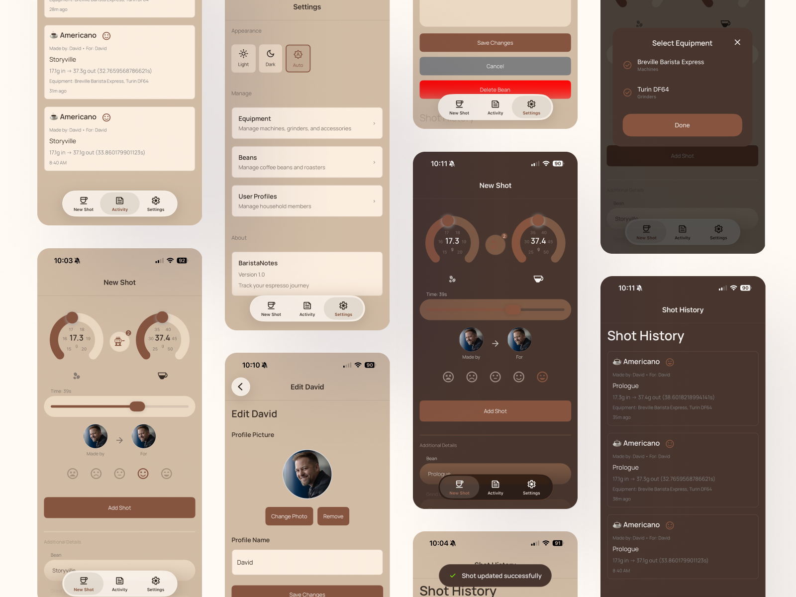

# BaristaNotes

BaristaNotes is a .NET MAUI application for recording coffee drinks across
espresso and manual brewing methods. It uses MauiReactor for declarative UI,
Entity Framework Core with SQLite for local data, and optional AI services for
advice, voice commands, image analysis, and grind translation.



## Features

- Log drinks for espresso, pour over, V60, moka, drip, Aeropress, French press,
  Turkish, siphon, cupping, cold brew, cold drip, and steep-and-release methods.
- Set Auto or Custom input ranges for dose, yield, grind size, and time.
  Auto ranges adapt to the selected brew method. Custom ranges are stored per
  metric and brew method.
- Manage beans, physical bags, equipment, grinder profiles, and user profiles.
- Track ratings on the project-wide 0-4 sentiment scale.
- Review and filter drink history.
- Store recipes and translate grind settings to a grinder-independent micron
  value.
- Request optional AI advice and use voice or photo workflows.
- Use light, dark, or system themes.
- Keep data locally in SQLite with data-preserving schema upgrades.

## Technology

The project files are the source of truth for exact package versions.

| Area | Current technology |
|---|---|
| Runtime | .NET 11 Preview 7 |
| App framework | .NET MAUI 11 |
| UI | MauiReactor 4.0.18 |
| Data | Entity Framework Core 11 Preview 7 and SQLite |
| UI support | CommunityToolkit.Maui 15.0.0 and UXDivers.Popups.Maui 0.9.4 |
| AI | Microsoft.Extensions.AI 10.9.0 and Azure.AI.OpenAI 2.9.0-beta.1 |
| Configuration | Shiny.Extensions.Configuration 5.4.0 |
| Tests | xUnit 2.9.3, Moq, and SQLite in-memory databases |

CoreSync packages are present for future synchronization work. The current app
stores its data locally and does not perform cloud synchronization.

## Repository Layout

```text
src/
  BaristaNotes/          # MAUI application
  BaristaNotes.Core/     # Models, data access, and domain services
  BaristaNotes.Tests/    # Unit and integration tests
  BaristaNotes.sln
docs/                    # Current developer documentation
specs/                   # Historical feature specifications and plans
```

See [Project Structure](docs/PROJECT_STRUCTURE.md) for more detail.

## Build and Test

Install the .NET 11 Preview 7 SDK and the MAUI workloads that match it.

```bash
dotnet workload restore src/BaristaNotes/BaristaNotes.csproj
dotnet restore src/BaristaNotes.sln

dotnet build src/BaristaNotes -f net11.0-ios
dotnet build src/BaristaNotes -f net11.0-android
dotnet build src/BaristaNotes -f net11.0-maccatalyst

dotnet test src/BaristaNotes.Tests
```

On Windows, the app also targets `net11.0-windows10.0.19041.0`.

For the full setup and run workflow, see
[Getting Started](docs/GETTING_STARTED.md).

## Local AI Configuration

AI features are optional. Most cloud AI paths use these configuration keys:

```json
{
  "AzureOpenAI": {
    "Endpoint": "https://YOUR-RESOURCE.openai.azure.com/",
    "ApiKey": "YOUR-LOCAL-DEVELOPMENT-KEY"
  }
}
```

For iOS and Mac Catalyst, save this content in:

```text
src/BaristaNotes/appsettings.Development.json
```

For Android, save it in:

```text
src/BaristaNotes/Platforms/Android/Assets/appsettings.Development.json
```

Both files are ignored by Git. Debug builds load the development file over
`appsettings.json`. Do not commit API keys.

Older local files can contain an `OpenAI` section. That section is no longer
read. Rename it to `AzureOpenAI` and add the resource endpoint.

Supported non-NativeAOT iOS builds try Apple Intelligence first and can fall
back to Azure OpenAI. NativeAOT releases exclude the Apple Intelligence
integration and use Azure OpenAI when it is configured.

The app currently uses `gpt-4.1-mini` for advice, voice commands, and grind
translation. Image workflows use `gpt-4o` and `gpt-4o-mini`.

An API key embedded in a mobile application can be extracted. A production
application should send authenticated requests to a backend that calls Azure
OpenAI. The backend must keep the key and must not return it to the app.

## Data and Schema Updates

The SQLite file is named `barista_notes.db` and is stored under
`FileSystem.AppDataDirectory`.

The app initializes and upgrades the database through
`DatabaseInitializer`. It preserves existing records, validates the resulting
schema, and records migration identifiers in `__EFMigrationsHistory`.
NativeAOT builds use the checked-in EF compiled model and query interceptors.

Do not delete the app, its data directory, or the database to fix a schema
problem. See [Data Layer](docs/DATA_LAYER.md) for the supported process.

## iOS NativeAOT Release

Use `dotnet publish`, not `dotnet build -t:Publish`:

```bash
dotnet publish src/BaristaNotes/BaristaNotes.csproj \
  -f net11.0-ios -c Release -r ios-arm64 \
  -p:EnableNativeAot=true \
  -p:PublishAot=true \
  -p:PublishAotUsingRuntimePack=true \
  -p:MicrosoftNETCoreAppRefPackageVersion=11.0.0-preview.7.26381.103 \
  -p:MtouchLink=Full
```

Important constraints:

- Do not pass `TargetFrameworks=net11.0-ios`. That global property also reaches
  `BaristaNotes.Core` and removes its required `net11.0` restore target.
- Keep `MicrosoftNETCoreAppRefPackageVersion` aligned with the installed SDK
  until the iOS and Android workloads use the same runtime pack.
- Review all `IL2xxx` and `IL3xxx` warnings before installation.
- Install over the existing app. Do not uninstall first because uninstalling
  deletes the app data.

## Development Documentation

- [Getting Started](docs/GETTING_STARTED.md)
- [Project Structure](docs/PROJECT_STRUCTURE.md)
- [Data Layer](docs/DATA_LAYER.md)
- [Service Architecture](docs/SERVICES.md)
- [MauiReactor Patterns](docs/MAUIREACTOR_PATTERNS.md)
- [Contributing](docs/CONTRIBUTING.md)
- [Project Constitution](.specify/memory/constitution.md)
- [Architecture Constraints](.specify/ARCHITECTURE_CONSTRAINTS.md)

Documents under `docs/archive/` and feature records under `specs/` are
historical. They can describe older target frameworks and designs.

## License

BaristaNotes is licensed under the [MIT License](LICENSE).
