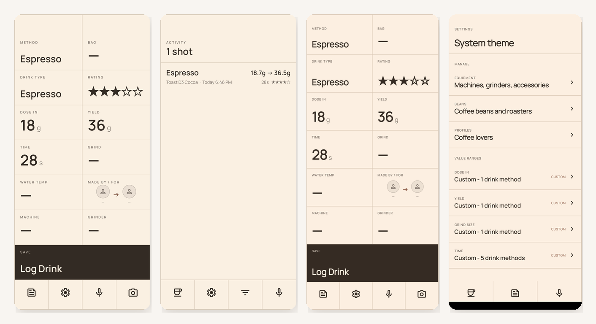
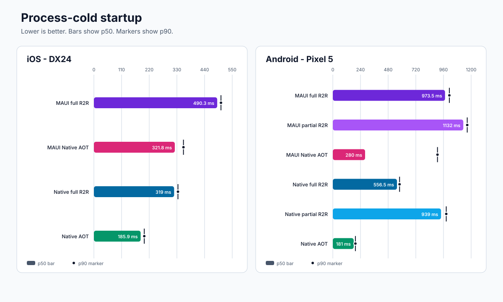

# BaristaNotes

BaristaNotes is a personal coffee journal for recording espresso and manual
brewing methods. The current application has native .NET for iOS and .NET for
Android heads built with UIKit and Android Views. Models, data access,
workflows, AI services, and presentation values are shared through
`BaristaNotes.Core`.

The .NET MAUI application remains in the repository as the feature and design
reference. It also provides the Mac Catalyst and Windows heads. The native
mobile apps do not depend on `Microsoft.Maui.Controls`.



Current native iOS and Android application captures. These are running-app
screenshots, not design mockups.

## Features

- Log drinks for espresso, pour over, V60, moka, drip, Aeropress, French press,
  Turkish, siphon, cupping, cold brew, cold drip, and steep-and-release methods.
- Set Auto or Custom input ranges for dose, yield, grind size, and time.
  Auto ranges adapt to the selected brew method. Custom ranges are stored per
  metric and brew method.
- Manage beans, physical bags, equipment, grinder profiles, and user profiles.
- Track ratings on the project-wide 0-4 sentiment scale.
- Review and filter drink history.
- Store recipes and translate grind settings to a grinder-independent micron
  value.
- Request optional AI advice and use voice or photo workflows.
- Use light, dark, or system themes.
- Keep data locally in SQLite with data-preserving schema upgrades.

## Technology

The project files are the source of truth for exact package versions.

| Area | Current technology |
|---|---|
| Runtime and toolchain | .NET 11 RC2 |
| Native iOS | .NET for iOS with UIKit |
| Native Android | .NET for Android with Android Views and RecyclerView |
| Reference app | .NET MAUI 11 with MauiReactor 4.0.18 |
| Shared application layer | `BaristaNotes.Core` |
| Data | Entity Framework Core 11 and SQLite |
| AI | Microsoft.Extensions.AI 10.9.0 and Azure.AI.OpenAI 2.9.0-beta.1 |
| Tests | xUnit 2.9.3, Moq, and isolated in-memory/file-backed SQLite databases |

CoreSync packages are present for future synchronization work. The current app
stores its data locally and does not perform cloud synchronization.

## Repository Layout

```text
src/
  BaristaNotes/          # MAUI feature and design reference
  BaristaNotes.Core/     # Shared models, data, workflows, and presentation values
  BaristaNotes.iOS/      # Native UIKit application
  BaristaNotes.Android/  # Native Android Views application
  BaristaNotes.iOS.Ailoha/      # Debug-only native Swift agent binding
  BaristaNotes.Android.Ailoha/  # Debug-only native Android agent binding
  BaristaNotes.Tests/    # Unit and integration tests
  BaristaNotes.sln
docs/                    # Current developer documentation
specs/                   # Historical feature specifications and plans
```

See [Project Structure](docs/PROJECT_STRUCTURE.md) for more detail.

## Build and Test

Install a consistent .NET 11 RC2 SDK and matching iOS, Android, and MAUI
workloads.

```bash
dotnet restore src/BaristaNotes.sln

# Native mobile heads
dotnet build src/BaristaNotes.iOS/BaristaNotes.iOS.csproj -c Release
dotnet build src/BaristaNotes.Android/BaristaNotes.Android.csproj -c Release

# MAUI reference heads
dotnet build src/BaristaNotes -f net11.0-ios
dotnet build src/BaristaNotes -f net11.0-android
dotnet build src/BaristaNotes -f net11.0-maccatalyst

dotnet test src/BaristaNotes.Tests
```

On Windows, the app also targets `net11.0-windows10.0.19041.0`.

The RC2 SDK and workload package builds must agree. The measured environment
needed a session-only runtime-pack override because the installed SDK requested
build `26478.115` while the available workload packs were `26475.136`. See the
[runtime comparison](docs/native-aot-runtime-comparison.md) before substituting
package versions.

For the MAUI reference-head setup and DevFlow run workflow, see
[Getting Started](docs/GETTING_STARTED.md). The native-head guides linked below
cover the platform-specific projects.

## Architecture

The native heads use platform controls and navigation while sharing application
behavior through `BaristaNotes.Core`:

- [Native iOS](src/BaristaNotes.iOS/README.md)
- [Native Android](src/BaristaNotes.Android/README.md)

Native controls own layout, accessibility, navigation, media capture, and
platform integration. Core owns drink loading and saving, validation, method
defaults, selectors, filters, settings workflows, image-analysis routing,
voice-command tools, and display formatting.

Debug builds can use native Ailoha inspection agents through local binding
projects. Release builds exclude the agents and binding projects. Keep native
agent binaries, development configuration, credentials, and generated packages
out of source control.

## Local AI Configuration

AI features are optional. Most cloud AI paths use these configuration keys:

```json
{
  "AzureOpenAI": {
    "Endpoint": "https://YOUR-RESOURCE.openai.azure.com/",
    "ApiKey": "YOUR-LOCAL-DEVELOPMENT-KEY"
  }
}
```

The native iOS and Android heads, plus the MAUI Apple heads, read:

```text
src/BaristaNotes/appsettings.Development.json
```

The MAUI Android head can also read:

```text
src/BaristaNotes/Platforms/Android/Assets/appsettings.Development.json
```

Both files are ignored by Git. Personal native Release builds currently bundle
the shared development file when it exists. This supports the private device
workflow, but it is not secure for public distribution. Do not commit API keys
or distribute packages that contain them.

Older local files can contain an `OpenAI` section. That section is no longer
read. Rename it to `AzureOpenAI` and add the resource endpoint.

The native iOS head tries Apple Intelligence first on iOS 26 and can fall back
to Azure OpenAI. The MAUI iOS head uses Apple Intelligence only in supported
non-NativeAOT builds. Its NativeAOT configuration excludes that integration and
uses Azure OpenAI when it is configured.

The app currently uses `gpt-4.1-mini` for advice, voice commands, and grind
translation. Image workflows use `gpt-4o` and `gpt-4o-mini`.

An API key embedded in a mobile application can be extracted. A production
application should send authenticated requests to a backend that calls Azure
OpenAI. The backend must keep the key and must not return it to the app.

## Data and Schema Updates

The SQLite file is named `barista_notes.db`. Each head stores it in the
platform application-data directory. Every application identity has its own
sandbox.

The app initializes and upgrades the database through
`DatabaseInitializer`. It preserves existing records, validates the resulting
schema, and records migration identifiers in `__EFMigrationsHistory`.
NativeAOT builds use the checked-in EF compiled model and query interceptors.

Do not delete the app, its data directory, or the database to fix a schema
problem. See [Data Layer](docs/DATA_LAYER.md) for the supported process.

## Runtime Performance

The benchmark matrix compares the MAUI and native architectures with CoreCLR
full R2R, Android partial R2R, and Native AOT. It uses isolated application
identities and the same accepted 1,000-drink fixture.



Native AOT produced the best startup, memory, and package-size results for the
native heads. Android MAUI Native AOT has a fast median but a long startup
tail. iOS partial R2R is not supported by the current workload.

See [Runtime and UI architecture performance comparison](docs/native-aot-runtime-comparison.md)
for the full methodology, package identities, memory results, transition
results, warning analysis, and raw-evidence locations.

## Development Documentation

- [Getting Started](docs/GETTING_STARTED.md)
- [Project Structure](docs/PROJECT_STRUCTURE.md)
- [Data Layer](docs/DATA_LAYER.md)
- [Service Architecture](docs/SERVICES.md)
- [Native Architecture Refactor](docs/native-architecture-refactor-report.md)
- [Runtime Performance Comparison](docs/native-aot-runtime-comparison.md)
- [MauiReactor Patterns](docs/MAUIREACTOR_PATTERNS.md)
- [Contributing](docs/CONTRIBUTING.md)
- [Project Constitution](.specify/memory/constitution.md)
- [Architecture Constraints](.specify/ARCHITECTURE_CONSTRAINTS.md)

Documents under `docs/archive/` and feature records under `specs/` are
historical. They can describe older target frameworks and designs.

## License

BaristaNotes is licensed under the [MIT License](LICENSE).
The optional native Ailoha binaries have their own binary distribution license.
See the binding-project guides and preserved upstream notices; the app license
does not replace those terms.
