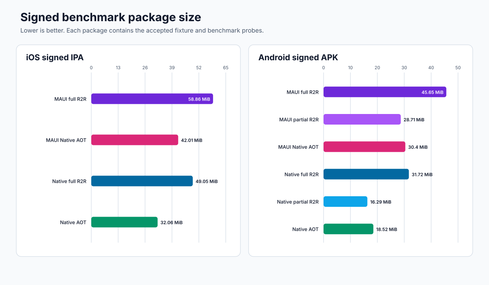
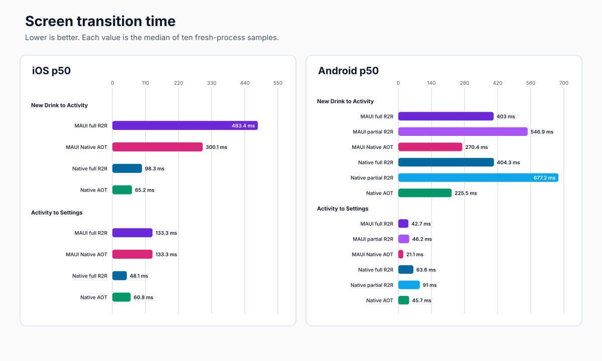
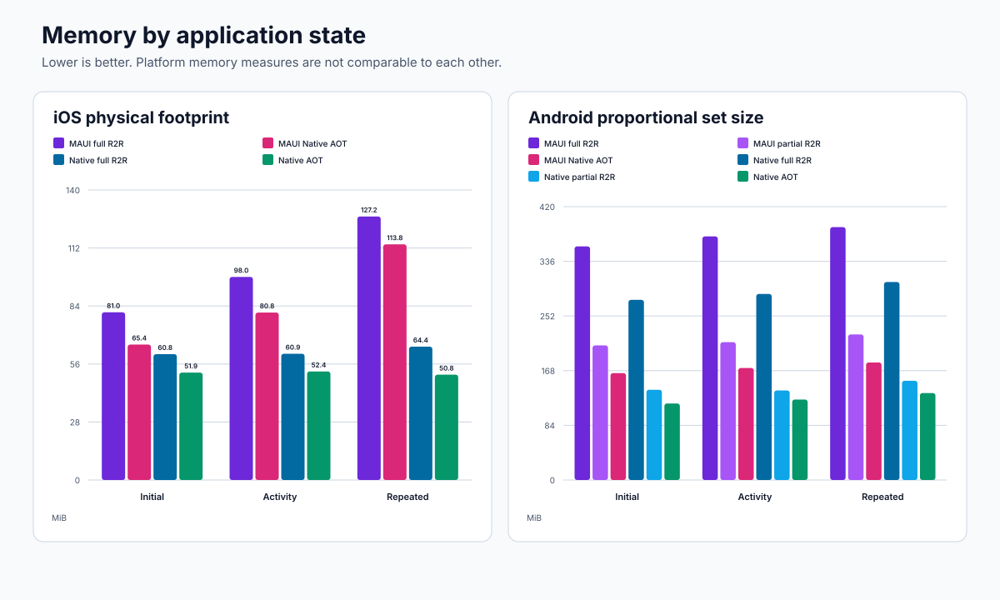

# BaristaNotes runtime and UI architecture performance comparison

This report compares the BaristaNotes .NET MAUI application with the native
.NET for iOS and .NET for Android applications. It covers CoreCLR full
ReadyToRun (R2R), CoreCLR partial R2R where the workload supports it, and
Native AOT.

All measured packages use the accepted 1,000-drink fixture. All comparisons
use the same physical device for one platform. These results describe this
application and these builds. They are not general framework benchmarks.

## Result

### Coverage against the requested runtime matrix

| Runtime | MAUI Android | MAUI iOS | .NET for Android | .NET for iOS |
|---|---|---|---|---|
| CoreCLR full R2R | Measured | Measured | Measured | Measured |
| CoreCLR partial R2R | Measured | Not applicable | Measured | Not applicable |
| Native AOT | Measured | Measured with accepted compiler warning | Measured | Measured |

The .NET 11 RC2 iOS workload does not provide a supported, preview, or
experimental partial-R2R mode. Its targets provide full composite R2R only.
Adding the internal Crossgen2 `--partial` argument without an iOS profile
contract would create a custom compiler experiment. It would not be an iOS
workload configuration.

The MAUI iOS Native AOT publish completed, but it produced this diagnostic:

```text
UIKit.NSLayoutAnchor<T>_Proxy.CreateObject(native int) will always throw
```

A stock .NET 11 RC2 MAUI template produces the same diagnostic. This confirms
that the issue is in the current MAUI and iOS Native AOT toolchain. It is not
caused by a BaristaNotes package or handler. The user approved isolated
benchmark measurement despite this warning. The measured routes did not call
the affected method.

### Main findings

- Native AOT has the best Android startup, memory, and package-size results.
- On Android, native AOT starts 35.4% faster at p50 than MAUI Native AOT. It
  also uses 26.0% to 28.4% less PSS.
- MAUI Native AOT startup is bimodal. Its p50 is 280 ms, but its p90 is
  908 ms. Seven of 30 launches were between 878 ms and 1,020 ms.
- Android full R2R starts faster than partial R2R in both app architectures.
  Partial R2R uses much less memory and produces a much smaller package.
- Native Android full R2R starts 42.8% faster than MAUI full R2R. Native
  Android partial R2R starts 17.0% faster than MAUI partial R2R.
- Android screen transitions do not have one universal winner. Native AOT is
  16.6% faster for New Drink to Activity. MAUI AOT is faster for the short
  Activity to Settings route.
- On iOS, native full R2R starts 34.9% faster than MAUI full R2R. Native AOT
  starts 42.2% faster than MAUI Native AOT.
- MAUI iOS Native AOT starts 34.4% faster than MAUI full R2R. It also reduces
  physical footprint by 10.6% to 19.2%.
- All supported runtime cells now have measurements. The two iOS partial-R2R
  cells remain not applicable.

## Test identity

| Item | iOS | Android |
|---|---|---|
| Device | DX24, iPhone 15 Pro (`iPhone16,1`) | Pixel 5 (`redfin`) |
| OS | iOS 26.7.1, build 23H30 | Android 14, API 34 |
| CPU architecture | arm64e | arm64-v8a |
| Connection | Wired | USB |
| Data | Accepted 1,000-drink fixture | Accepted 1,000-drink fixture |
| Source | Commit `883448a` plus conditional probes | Commit `883448a` plus conditional probes |
| SDK | `11.0.100-rc.2.26478.115` | `11.0.100-rc.2.26478.115` |
| Workload | iOS `27.0.12211-net11-rc.2` | Android `37.2.0-rc.2.84`, MAUI `11.0.0-rc.2.26475.3` |
| Runtime-pack override | `11.0.0-rc.2.26475.136` | `11.0.0-rc.2.26475.136` |
| Animation scales | Not applicable | Window 0, transition 0, animator 0 |
| Thermal status | Not available through the collection channel | Status 0 before and after |
| Battery | Not recorded | USB powered, 100% before and after |

The full Android collection ran from October 1, 2026 at 03:23 UTC to 04:14
UTC. The MAUI iOS Native AOT collection ran from 12:58 UTC to 13:06 UTC. The
earlier native Android and iOS collection ran on September 30, 2026. The MAUI
iOS full-R2R collection ran later that day.

## Package size

Lower is better. These are signed benchmark packages. They include the same
fixture and equivalent performance instrumentation for one platform.



### iOS

| App and runtime | Bytes | MiB |
|---|---:|---:|
| MAUI CoreCLR full R2R | 61,715,597 | 58.86 |
| MAUI Native AOT | 44,052,724 | 42.01 |
| Native CoreCLR full R2R | 51,431,910 | 49.05 |
| Native AOT | 33,618,579 | 32.06 |

MAUI Native AOT is 28.6% smaller than MAUI full R2R. Native iOS full R2R is
16.7% smaller than MAUI full R2R. Native iOS Native AOT is 23.7% smaller than
MAUI Native AOT and 45.5% smaller than MAUI full R2R.

### Android

| App | Runtime | Bytes | MiB |
|---|---|---:|---:|
| MAUI | CoreCLR full R2R | 47,864,112 | 45.65 |
| MAUI | CoreCLR partial R2R | 30,107,952 | 28.71 |
| MAUI | Native AOT | 31,872,596 | 30.40 |
| Native | CoreCLR full R2R | 33,263,964 | 31.72 |
| Native | CoreCLR partial R2R | 17,076,572 | 16.29 |
| Native | Native AOT | 19,414,722 | 18.52 |

For the same runtime, the native Android package is 30.5% smaller for full
R2R, 43.3% smaller for partial R2R, and 39.1% smaller for Native AOT.

Partial R2R reduces package size by 37.1% in MAUI and 48.7% in the native
Android app when compared with full R2R.

## Process-cold startup

Lower is better. Each runtime has one pilot launch, five conditioning
launches, and 30 measured cold-process launches. Android uses `am start -W`
`TotalTime`. The collector also confirms that the New Drink page is ready
with the 1,000-drink fixture.


### iOS

The iOS timer starts at the kernel process-start timestamp. It ends after the
New Drink screen is loaded and two display frames complete.

| App | Runtime | n | p50 | p90 | Min | Max |
|---|---|---:|---:|---:|---:|---:|
| MAUI | CoreCLR full R2R | 30 | 490.3 ms | 505.3 ms | 464.0 ms | 677.5 ms |
| MAUI | Native AOT | 30 | 321.8 ms | 356.1 ms | 302.4 ms | 375.8 ms |
| Native | CoreCLR full R2R | 30 | 319.0 ms | 334.3 ms | 311.1 ms | 341.0 ms |
| Native | Native AOT | 30 | 185.9 ms | 200.3 ms | 176.4 ms | 208.7 ms |

MAUI Native AOT is 34.4% faster than MAUI full R2R at p50. Native AOT is
42.2% faster than MAUI Native AOT.

### Android

| App | Runtime | n | p50 | p90 | Min | Max |
|---|---|---:|---:|---:|---:|---:|
| MAUI | CoreCLR full R2R | 30 | 973.5 ms | 1,011 ms | 948 ms | 1,015 ms |
| MAUI | CoreCLR partial R2R | 30 | 1,132.0 ms | 1,166 ms | 1,094 ms | 1,201 ms |
| MAUI | Native AOT | 30 | 280.0 ms | 908 ms | 242 ms | 1,020 ms |
| Native | CoreCLR full R2R | 30 | 556.5 ms | 579 ms | 542 ms | 596 ms |
| Native | CoreCLR partial R2R | 30 | 939.0 ms | 984 ms | 914 ms | 1,023 ms |
| Native | Native AOT | 30 | 181.0 ms | 196 ms | 155 ms | 215 ms |

Matched architecture results:

| Runtime | Native p50 difference from MAUI | Native p90 difference from MAUI |
|---|---:|---:|
| CoreCLR full R2R | 42.8% faster | 42.7% faster |
| CoreCLR partial R2R | 17.0% faster | 15.6% faster |
| Native AOT | 35.4% faster | 78.4% faster |

The large Native AOT p90 difference is caused by the MAUI long-startup tail.
The native Android Native AOT distribution does not have that tail.

## Screen transitions

Lower is better. Each route has ten fresh-process samples. Android timing
starts at the navigation action-handler entry and ends at the qualified frame
commit callback.



### iOS

| Route | App | Runtime | n | p50 | p90 |
|---|---|---|---:|---:|---:|
| New Drink -> Activity | MAUI | CoreCLR full R2R | 10 | 483.4 ms | 487.6 ms |
| New Drink -> Activity | MAUI | Native AOT | 10 | 300.1 ms | 300.1 ms |
| New Drink -> Activity | Native | CoreCLR full R2R | 10 | 98.3 ms | 98.4 ms |
| New Drink -> Activity | Native | Native AOT | 10 | 65.2 ms | 65.3 ms |
| Activity -> Settings | MAUI | CoreCLR full R2R | 10 | 133.3 ms | 133.4 ms |
| Activity -> Settings | MAUI | Native AOT | 10 | 133.3 ms | 133.4 ms |
| Activity -> Settings | Native | CoreCLR full R2R | 10 | 48.1 ms | 48.1 ms |
| Activity -> Settings | Native | Native AOT | 10 | 60.8 ms | 65.2 ms |

MAUI Native AOT is 37.9% faster than MAUI full R2R for New Drink to Activity.
It does not improve the short Activity to Settings route. Native AOT is 78.3%
faster than MAUI Native AOT for New Drink to Activity and 54.4% faster for
Activity to Settings.

### Android

| Route | App | Runtime | n | p50 | p90 |
|---|---|---|---:|---:|---:|
| New Drink -> Activity | MAUI | CoreCLR full R2R | 10 | 403.0 ms | 526.1 ms |
| New Drink -> Activity | Native | CoreCLR full R2R | 10 | 404.3 ms | 457.9 ms |
| New Drink -> Activity | MAUI | CoreCLR partial R2R | 10 | 546.9 ms | 622.6 ms |
| New Drink -> Activity | Native | CoreCLR partial R2R | 10 | 677.2 ms | 740.2 ms |
| New Drink -> Activity | MAUI | Native AOT | 10 | 270.4 ms | 298.8 ms |
| New Drink -> Activity | Native | Native AOT | 10 | 225.5 ms | 232.8 ms |
| Activity -> Settings | MAUI | CoreCLR full R2R | 10 | 42.7 ms | 65.0 ms |
| Activity -> Settings | Native | CoreCLR full R2R | 10 | 63.6 ms | 67.3 ms |
| Activity -> Settings | MAUI | CoreCLR partial R2R | 10 | 46.2 ms | 65.9 ms |
| Activity -> Settings | Native | CoreCLR partial R2R | 10 | 91.0 ms | 95.2 ms |
| Activity -> Settings | MAUI | Native AOT | 10 | 21.1 ms | 24.5 ms |
| Activity -> Settings | Native | Native AOT | 10 | 45.7 ms | 52.0 ms |

The New Drink to Activity route performs data loading and list creation. The
short Activity to Settings route is more sensitive to frame scheduling.

The matched Android results are mixed:

- Full R2R New Drink to Activity is effectively tied at p50.
- MAUI is faster for both partial-R2R transitions.
- Native AOT is 16.6% faster for New Drink to Activity.
- MAUI Native AOT is faster for Activity to Settings.

## Memory

Lower is better. Each state has ten independent process runs. Each run uses
the median of three snapshots after a ten-second settle. Repeated navigation
performs five Settings -> New Drink -> Activity cycles.



### iOS physical footprint

Physical footprint is the primary iOS memory measure.

| State | MAUI full R2R p50 | MAUI AOT p50 | Native full R2R p50 | Native AOT p50 |
|---|---:|---:|---:|---:|
| Initial New Drink | 80.96 MiB | 65.38 MiB | 60.75 MiB | 51.85 MiB |
| First Activity | 98.04 MiB | 80.84 MiB | 60.94 MiB | 52.39 MiB |
| Repeated navigation | 127.21 MiB | 113.77 MiB | 64.37 MiB | 50.84 MiB |

MAUI Native AOT reduces physical footprint by 19.2% for Initial New Drink,
17.5% for First Activity, and 10.6% after repeated navigation. Native AOT uses
20.7% to 55.3% less physical footprint than MAUI Native AOT.

### Android proportional set size

PSS is the primary Android memory measure.

| State | MAUI full R2R | Native full R2R | MAUI partial R2R | Native partial R2R | MAUI AOT | Native AOT |
|---|---:|---:|---:|---:|---:|---:|
| Initial New Drink | 358.99 MiB | 276.83 MiB | 206.81 MiB | 138.64 MiB | 164.26 MiB | 117.58 MiB |
| First Activity | 374.32 MiB | 285.89 MiB | 211.78 MiB | 137.63 MiB | 172.12 MiB | 123.61 MiB |
| Repeated navigation | 388.55 MiB | 304.23 MiB | 223.63 MiB | 152.49 MiB | 180.58 MiB | 133.63 MiB |

Matched architecture results:

| Runtime | Native PSS difference from MAUI |
|---|---|
| CoreCLR full R2R | 21.7% to 23.6% lower |
| CoreCLR partial R2R | 31.8% to 35.0% lower |
| Native AOT | 26.0% to 28.4% lower |

Partial R2R has a clear size and memory benefit over full R2R. That benefit
comes with slower startup and slower New Drink to Activity results.

The raw result files also contain private dirty, RSS, swap PSS, and Android
memory-category values for every process.

## Build warnings and release risk

The measured MAUI iOS Native AOT package contains a `will always throw`
diagnostic. The MAUI application and the stock MAUI template both produce the
same `NSLayoutAnchor<T>_Proxy.CreateObject` diagnostic.

The user approved installation of an isolated benchmark package despite this
warning. Startup, New Drink, Activity, Settings, and repeated navigation did
not call the affected method. This successful benchmark does not make the
warning safe for a personal release. Other layouts or controls can still call
the generated proxy and fail.

Other warnings include:

- EF Core and SQLite trim and AOT analysis warnings
- EF Core `DependencyContext` use in a single-file application
- Microsoft Recognizers trim warnings
- Apple Intelligence JSON serialization trim warnings on iOS
- Azure Core trim warnings
- Android `XA1040`, which states that Android Native AOT is experimental and
  is not suitable for production use

The benchmark paths loaded the database, New Drink, Activity, Settings, and
repeated navigation. They did not validate every feature under Native AOT.
Camera, Azure OpenAI extraction, speech, editors, and all settings flows need
a separate functional pass before a personal release uses Native AOT.

## Method and limits

- A process-cold launch does not mean cold filesystem, database, or
  operating-system caches.
- Compare runtime results only on the same platform. The iOS and Android
  startup timers have different contracts.
- Full R2R was built without the Crossgen2 `--partial` argument.
- Partial R2R was built with `--partial` and Android profile-guided R2R.
- CoreCLR packages contain `libcoreclr.so` and `libclrjit.so`.
- Android Native AOT packages contain the application native library and do
  not contain CoreCLR or JIT libraries.
- Android collection used four isolated new package identities. It did not
  change the personal BaristaNotes application or its data.
- The MAUI iOS Native AOT collection used the isolated bundle identifier
  `com.simplyprofound.baristanotes.maui.performance.aot`. It did not replace
  the personal BaristaNotes application.
- The MAUI iOS Native AOT result has an accepted compatibility warning. The
  benchmark proves only the measured routes.
- The collection ran one runtime package at a time. This can create order
  bias. Pixel 5 reported thermal status 0 before and after.
- iOS transition completion uses two display frames. Short transitions are
  quantized by frame scheduling.
- Android PSS and iOS physical footprint are different measures. Do not
  compare their absolute values.
- The RC2 SDK requested runtime packs from build `26478.115`. The available
  packs were build `26475.136`. All RC2 benchmark builds used the same
  session-only override.
- The build contains conditional performance instrumentation. Product
  application logic is unchanged.

## Artifact identity

| Platform | App | Runtime | SHA-256 |
|---|---|---|---|
| iOS | MAUI | CoreCLR full R2R | `effdcbe9a6facf52dd0a29a9302e7172ef508465ddb475e94979639034d40cf1` |
| iOS | MAUI | Native AOT | `d197cf492218e3dca263e98ee63bd8f68662e9513241dc0624150ac8ee191dd4` |
| iOS | Native | CoreCLR full R2R | `07936490f167a1a587d43632fa9cac340df8a7086563ab2ff83d978ac341c839` |
| iOS | Native | Native AOT | `ce56d70167f03ad896db2dbcc857599fb3e1af043aaadfac20f667e24e4a8a07` |
| Android | MAUI | CoreCLR full R2R | `f014e070cbb549bbe476a98f4e94aa1f713d56f4aa68a80323a507083edef491` |
| Android | MAUI | CoreCLR partial R2R | `10543b014c51f109867f8357baa79ed1881b84b07e4e397c0a11184d8f48aa76` |
| Android | MAUI | Native AOT | `30e18e51e047cfe08a9757407dc9c0e1b033665694fec4f3bf66cb28a7a438a6` |
| Android | Native | CoreCLR full R2R | `a9b91530bfcb0f8f0bcecdccf32f2dda47e5665fb136d6c617c3864909d00602` |
| Android | Native | CoreCLR partial R2R | `96f1c08fa7ed8419fc3942863cbe952d3fb9c0440ab0c711eabe1e90846a1de9` |
| Android | Native | Native AOT | `93d9873955187ca87e41e5221e1b1591e5c35fd81b98b6194dd0dba2d49ffc48` |

## Evidence

Raw samples, conditions, command output, and package metadata are in the
session artifact folder:

- `files/android-runtime-matrix/results/full-01/`
- `files/android-runtime-matrix/results/smoke-03/`
- `files/android-runtime-matrix/builds/`
- `files/android-runtime-matrix/runtime-identity.txt`
- `files/native-aot-benchmark/results/android-full-20261001/`
- `files/native-aot-benchmark/results/ios-full-20261001/`
- `files/maui-ios-benchmark/results/full-01/`
- `files/maui-ios-benchmark/publish3.log`
- `files/maui-aot-template-probe/publish-ios.log`
- `files/maui-ios-aot-benchmark/results/full-01/`
- `files/maui-ios-aot-benchmark/build/publish.log`

The main summary files are:

- `android-runtime-matrix/results/full-01/complete.json`
- `android-runtime-matrix/results/full-01/results.json`
- `android-runtime-matrix/results/full-01/startup.csv`
- `android-runtime-matrix/results/full-01/memory.csv`
- `android-runtime-matrix/results/full-01/transitions.csv`
- `native-aot-benchmark/results/android-full-20261001/complete.json`
- `native-aot-benchmark/results/ios-full-20261001/complete.json`
- `maui-ios-benchmark/results/full-01/complete.json`
- `maui-ios-aot-benchmark/results/full-01/complete.json`

Regenerate the embedded SVG charts with:

```bash
python3 scripts/generate-runtime-comparison-charts.py
```
