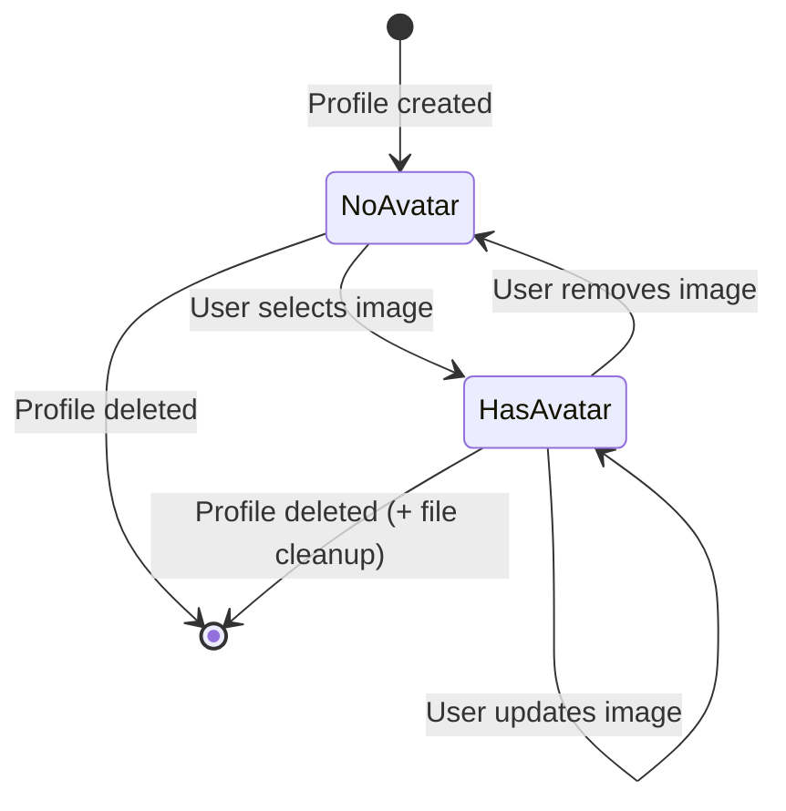

# Data Model: User Profile Image Picker

**Date**: 2025-12-05  
**Feature**: 003-profile-image-picker

## Overview

This document defines the data model changes and entities required for the user profile image picker feature.

---

## 1. Existing Model: UserProfile

**Location**: `BaristaNotes.Core/Models/UserProfile.cs`

### Current Schema
```csharp
public class UserProfile
{
    public int Id { get; set; }
    public string Name { get; set; } = string.Empty;
    public string? AvatarPath { get; set; }  // ← EXISTING FIELD
    public DateTimeOffset CreatedAt { get; set; }
    
    // CoreSync metadata
    public Guid SyncId { get; set; }
    public DateTimeOffset LastModifiedAt { get; set; }
    public bool IsDeleted { get; set; } = false;
    
    // Navigation properties
    public virtual ICollection<ShotRecord> ShotsMadeBy { get; set; }
    public virtual ICollection<ShotRecord> ShotsMadeFor { get; set; }
}
```

### Changes Required
**NONE** - The `AvatarPath` field already exists and is sufficient.

### Field Usage
- **Type**: `string?` (nullable)
- **Purpose**: Store relative path to avatar image file
- **Format**: `profile_avatar_{id}.jpg` (just filename, not full path)
- **Null Handling**: `null` indicates no avatar selected (show default placeholder)
- **Example Values**:
  - `null` → No avatar
  - `"profile_avatar_123.jpg"` → Avatar stored in app data directory

### Database Migration
**NOT REQUIRED** - Field already exists in schema from previous implementation.

---

## 2. New Entity: ImageValidationResult

**Location**: `BaristaNotes.Core/Services/ImageValidationResult.cs`

### Purpose
Enum to represent image validation outcomes.

### Schema
```csharp
namespace BaristaNotes.Core.Services;

public enum ImageValidationResult
{
    Valid,
    TooLarge,              // File size > 1MB
    DimensionsTooLarge,    // Width or height > 400px
    DimensionsTooSmall,    // Width or height < 100px
    InvalidFormat,         // Not a supported image format
    ProcessingFailed       // Unexpected error during validation
}
```

### Usage
Returned by `IImageProcessingService.ValidateImageAsync()` to communicate validation status to UI layer.

---

## 3. New Entity: ProfileImageUpdateResult

**Location**: `BaristaNotes.Core/Services/DTOs/ProfileImageUpdateResult.cs`

### Purpose
DTO to communicate the result of a profile image update operation.

### Schema
```csharp
namespace BaristaNotes.Core.Services.DTOs;

public class ProfileImageUpdateResult
{
    public bool Success { get; set; }
    public string? ErrorMessage { get; set; }
    public string? NewAvatarPath { get; set; }
    
    public static ProfileImageUpdateResult SuccessResult(string avatarPath) =>
        new() { Success = true, NewAvatarPath = avatarPath };
    
    public static ProfileImageUpdateResult FailureResult(string errorMessage) =>
        new() { Success = false, ErrorMessage = errorMessage };
}
```

### Usage
Returned by `IUserProfileService.UpdateProfileImageAsync()` to provide feedback to UI components.

---

## 4. Data Flow

### Image Selection & Storage Flow

```
1. User taps profile image
   ↓
2. MediaPicker opens native photo selector
   ↓
3. User selects photo (or cancels)
   ↓
4. [IF CANCELLED] → Return to previous state
   ↓
5. [IF SELECTED] → MediaPicker returns FileResult with processed stream
   ↓
6. ImageProcessingService validates image
   ↓
7. [IF INVALID] → Show error message to user
   ↓
8. [IF VALID] → Save stream to FileSystem.AppDataDirectory
   ↓
9. Generate filename: profile_avatar_{profileId}.jpg
   ↓
10. UserProfileService updates UserProfile.AvatarPath
   ↓
11. Save changes to database
   ↓
12. UI refreshes to show new avatar
```

### Image Retrieval & Display Flow

```
1. Load UserProfile from database
   ↓
2. Check UserProfile.AvatarPath
   ↓
3. [IF NULL] → Show default placeholder avatar
   ↓
4. [IF NOT NULL] → Construct full path:
   Path.Combine(FileSystem.AppDataDirectory, profile.AvatarPath)
   ↓
5. Check if file exists
   ↓
6. [IF NOT EXISTS] → Show default placeholder + log warning
   ↓
7. [IF EXISTS] → Load image from file
   ↓
8. Display in circular frame (UI layer handles cropping)
```

### Image Deletion Flow

```
1. User requests to remove avatar (or delete profile)
   ↓
2. Retrieve current UserProfile.AvatarPath
   ↓
3. [IF NULL] → Nothing to delete, return success
   ↓
4. [IF NOT NULL] → Construct full path
   ↓
5. Delete file from FileSystem.AppDataDirectory
   ↓
6. Set UserProfile.AvatarPath = null
   ↓
7. Save changes to database
   ↓
8. UI refreshes to show default placeholder
```

---

## 5. File System Schema

### Storage Structure

```
FileSystem.AppDataDirectory/
├── profile_avatar_1.jpg     # Avatar for UserProfile ID=1
├── profile_avatar_2.jpg     # Avatar for UserProfile ID=2
├── profile_avatar_15.jpg    # Avatar for UserProfile ID=15
└── [other app data files]
```

### File Characteristics
- **Naming Pattern**: `profile_avatar_{profileId}.jpg`
- **Format**: JPEG
- **Max Size**: 1MB (enforced by validation)
- **Resolution**: ≤400x400 pixels
- **Compression**: Quality 85

### Cleanup Scenarios
1. **On Profile Delete**: Delete associated avatar file
2. **On Avatar Update**: Delete old file before saving new
3. **App Uninstall**: OS automatically removes entire AppDataDirectory
4. **Orphan Files**: Periodic cleanup job (future enhancement) to remove files not referenced in DB

---

## 6. State Transitions

### UserProfile.AvatarPath States



**State Descriptions**:
- **NoAvatar**: `AvatarPath == null`, display default placeholder
- **HasAvatar**: `AvatarPath != null`, display image from file system

### Image Processing States

```
┌─────────────┐
│  Selected   │
└──────┬──────┘
       │
       ▼
┌─────────────┐
│ Validating  │
└──────┬──────┘
       │
       ├─────► Invalid ──► Error Message
       │
       ▼
┌─────────────┐
│   Saving    │
└──────┬──────┘
       │
       ├─────► Save Failed ──► Error Message
       │
       ▼
┌─────────────┐
│   Saved     │
└──────┬──────┘
       │
       ▼
┌─────────────┐
│  Displayed  │
└─────────────┘
```

---

## 7. Validation Rules

### Image Dimensions
- **Minimum**: 100x100 pixels (ensure quality for display)
- **Maximum**: 400x400 pixels (enforced by MediaPickerOptions + validation)
- **Aspect Ratio**: Any (circular crop handles non-square images)

### File Size
- **Maximum**: 1MB (hard limit)
- **Target**: <500KB (typical for JPEG @ quality 85)

### File Format
- **Accepted**: JPEG only
- **Extension**: `.jpg`
- **Rejected**: PNG, GIF, BMP, SVG, etc.

### File System
- **Path Length**: Must fit within OS limits (260 chars Windows, 1024 chars Unix)
- **Filename Characters**: Alphanumeric + underscore + dot (safe for all platforms)
- **File Permissions**: Read/write access to AppDataDirectory (guaranteed by OS)

---

## 8. Concurrency & Consistency

### Database Constraints
- **Primary Key**: `UserProfile.Id` (unique, auto-increment)
- **AvatarPath**: No database constraints (can be null, no foreign key)
- **LastModifiedAt**: Updated on any profile change including avatar

### Race Conditions
- **Multiple Updates**: Last write wins (file system + database)
- **Delete During Update**: Transaction ensures consistency
  - If file delete fails, DB rollback
  - If DB update fails, keep old file (cleanup later)

### Error Recovery
- **Partial Failure**: If file saves but DB update fails:
  - Orphan file remains (cleaned up later)
  - User sees old avatar until retry
- **File Not Found**: Display default placeholder + log warning
  - Don't fail hard, allow user to select new image

---

## 9. Security & Privacy

### File Access
- **Scope**: App-only (AppDataDirectory not accessible to other apps)
- **Permissions**: No special permissions required (app data directory)
- **Backup**: Included in iOS iCloud and Android backup (user-specific)

### Data Sensitivity
- **PII**: Profile images are personally identifiable
- **GDPR**: User can delete profile (removes image)
- **Metadata**: EXIF data stripped (`PreserveMetaData = false`)
- **Sharing**: Images not shared with other apps/services

---

## Summary

### Changes Required
- ✅ **UserProfile Model**: No changes (field exists)
- ✅ **New Enums**: `ImageValidationResult`
- ✅ **New DTOs**: `ProfileImageUpdateResult`
- ✅ **File System**: Standard MAUI `FileSystem.AppDataDirectory`
- ✅ **Migrations**: None required

### Key Design Decisions
1. **Reuse Existing Field**: `UserProfile.AvatarPath` already suitable
2. **Simple Storage**: Filename-only in DB, full path constructed at runtime
3. **Validation Enum**: Clear communication of validation failures
4. **Result DTO**: Structured error handling for UI
5. **File Naming**: Predictable pattern for easy cleanup

**Ready to proceed with API contract design**
